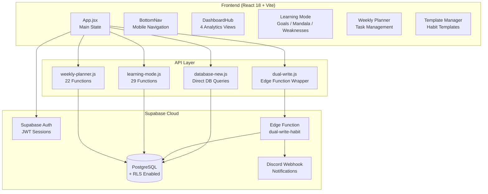
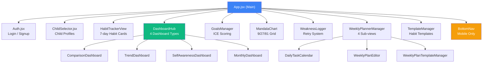
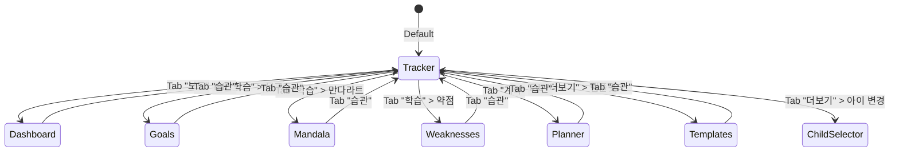
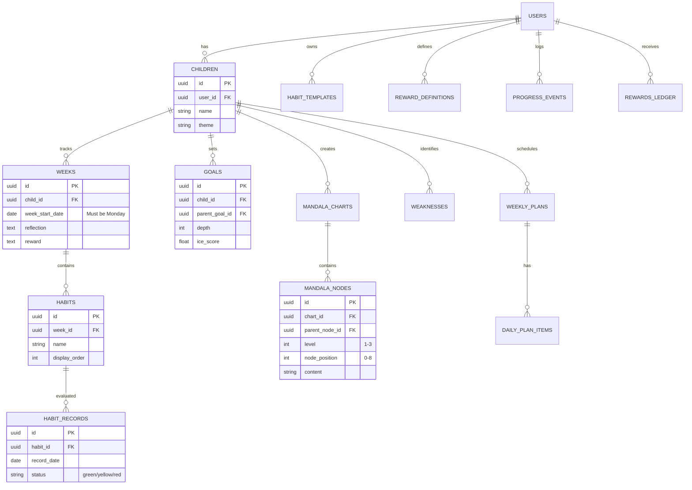
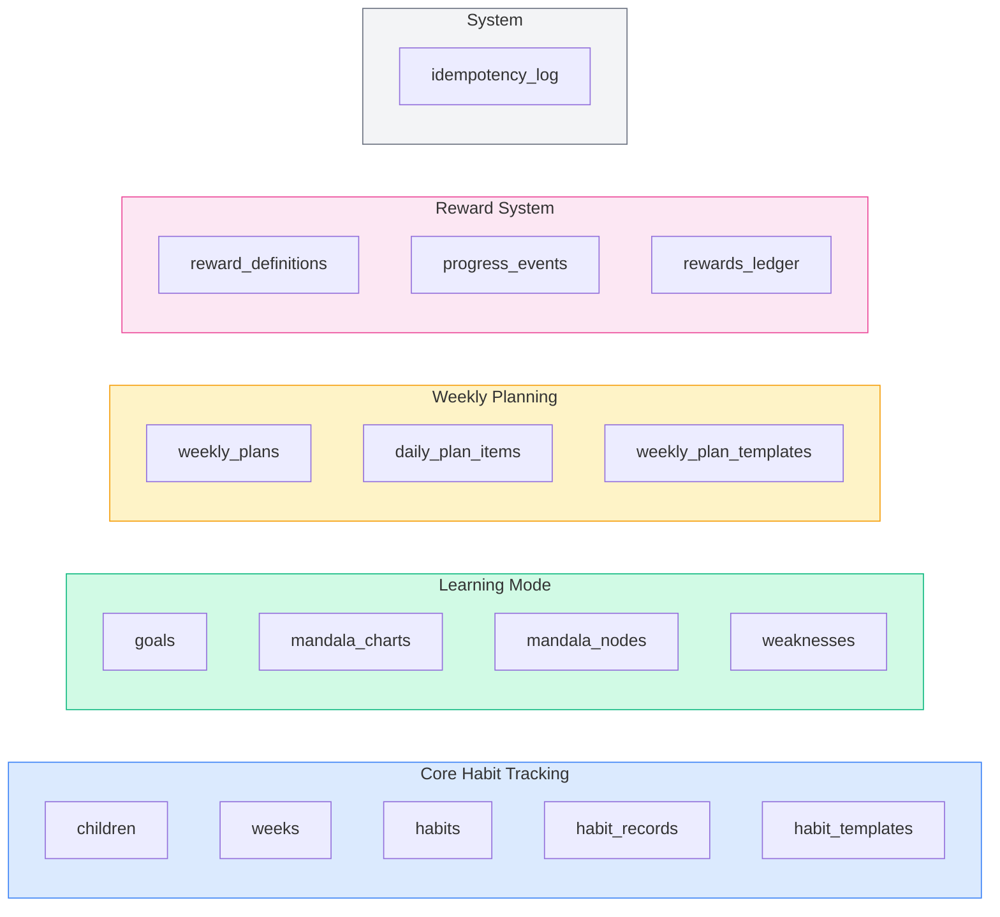
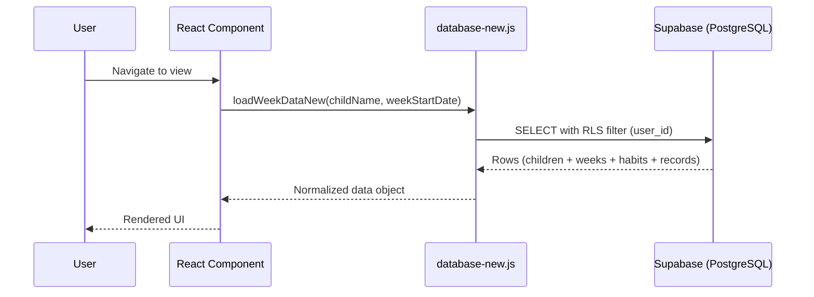
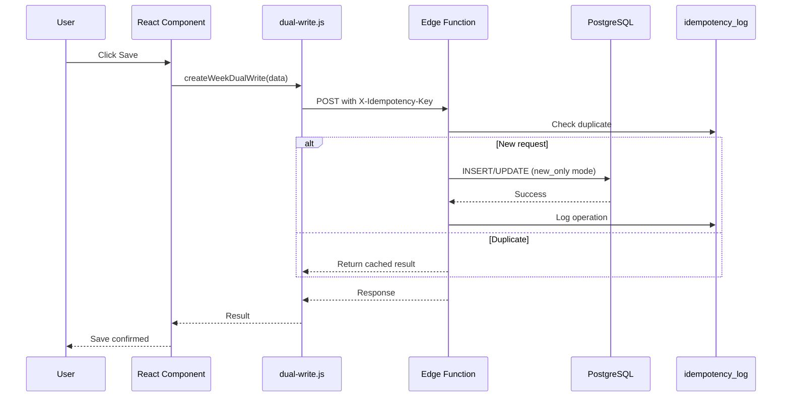
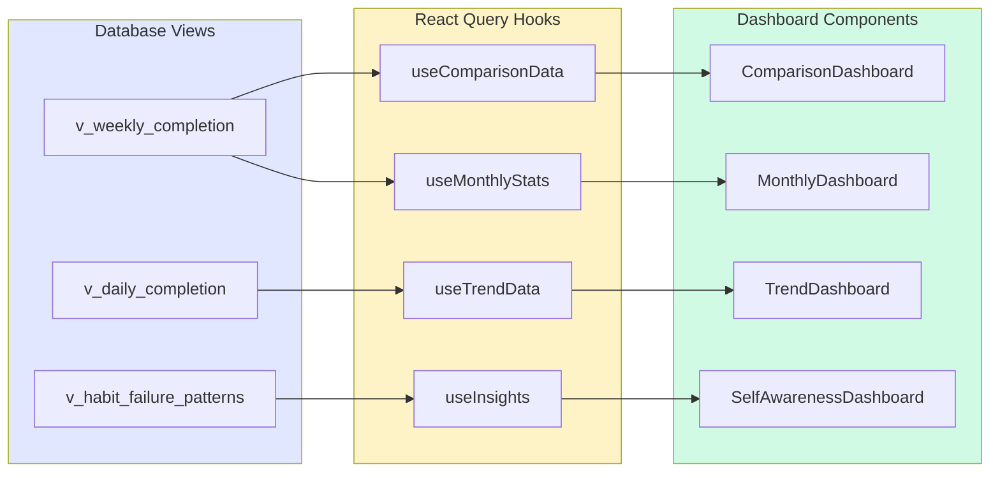

# Habit Tracker for Kids


**Last Updated**: 2026-03-14 | **Status**: Phase 5.5 Complete + Mobile UX Redesign

> A visual habit tracking web app for kids to build habits and manage learning goals with parents. Color-coded evaluation system (green/yellow/red), 4-type analytics dashboard, 81-cell Mandala charts, weekly planner, and achievement badges.

---

## Table of Contents

- [Features](#features)
- [Architecture](#architecture)
- [Database Schema](#database-schema)
- [Data Flow](#data-flow)
- [Tech Stack](#tech-stack)
- [Getting Started](#getting-started)
- [Project Structure](#project-structure)
- [Deployment](#deployment)
- [Version History](#version-history)
- [Contributing](#contributing)

---

## Features

### Core - Habit Tracking

| Feature | Description |
|---------|-------------|
| Color Code System | Green (achieved), Yellow (partial), Red (missed) |
| Weekly Tracking | Monday-based weekly periods with 7-day habit cards |
| Reflection & Reward | Weekly review and goal-based reward system |
| Multi-child Support | Individual profiles per child with theme customization |
| Manual Save | Explicit save for data safety |
| Habit Templates | Reusable habit sets with default template support |

### Dashboard - 4 Analytics Views

| View | Description |
|------|-------------|
| Comparison | Multi-child ranking with completion rates |
| Trends | Weekly trend charts (Recharts ComposedChart) |
| Self-Awareness | Strengths, weaknesses, day-of-week patterns |
| Monthly | Calendar view with month-over-month comparison |

### Learning Mode (Phase 5)

| Module | Description |
|--------|-------------|
| Goals | Hierarchical goals with ICE priority scoring |
| Mandala Chart | 9/27/81-cell expansion (3-level hierarchy) |
| Weaknesses | Retry tracking, pattern analysis, badge rewards |
| Weekly Planner | 7-day task management with templates |
| Achievements | 13 auto-detected reward triggers |

### Mobile UX (Latest)

| Feature | Description |
|---------|-------------|
| Bottom Tab Bar | 5-tab MyFitnessPal-style navigation |
| Compact Header | Sticky ~80px header (vs ~300px before) |
| Tap-to-Cycle | Single tap color cycling on mobile |
| Pill Tab Navigation | Scrollable dashboard tabs |
| Slide-up Sheets | Learning mode & more options overlay |

---

## Architecture

### System Overview



### Component Hierarchy



### View State Machine



---

## Database Schema

### Entity Relationship



### Table Groups



---

## Data Flow

### Read Operations



### Write Operations



### Dashboard Data Pipeline



---

## Tech Stack

| Category | Technology |
|----------|------------|
| **Frontend** | React 18 + Vite 4 |
| **Styling** | Tailwind CSS 3.3 + Custom Design System |
| **Icons** | Lucide React |
| **Charts** | Recharts 3.1 (ComposedChart, Area, Line) |
| **State** | React Hooks + React Query v5 (5min cache) |
| **Database** | Supabase PostgreSQL + RLS |
| **Auth** | Supabase Auth (JWT) |
| **Edge Functions** | Deno Runtime (Supabase) |
| **Notifications** | Discord Webhook |
| **Data Export** | XLSX Library |
| **PWA** | Web App Manifest + Service Workers |
| **Build** | Code splitting, Lazy loading (~313KB gzip) |

---

## Getting Started

### Prerequisites

- Node.js 18+
- npm
- Supabase account

### Quick Start

```bash
# 1. Clone
git clone https://github.com/Photometry4040/HabitTracker.git
cd HabitTracker

# 2. Install
npm install

# 3. Environment
cp .env.example .env
# Edit .env with your Supabase credentials:
#   VITE_SUPABASE_URL=https://your-project.supabase.co
#   VITE_SUPABASE_ANON_KEY=your_anon_key

# 4. Database setup
# Run migrations in supabase/migrations/ folder in order via Supabase SQL Editor

# 5. Run
npm run dev
# Open http://localhost:5173
```

### Supabase Setup

1. Create project at [supabase.com](https://supabase.com)
2. Run migrations from `supabase/migrations/` (38 SQL files)
3. Authentication > Settings:
   - Site URL: `http://localhost:5173`
   - Redirect URLs: `http://localhost:5173/**`

### Commands

| Command | Description |
|---------|-------------|
| `npm run dev` | Development server (localhost:5173) |
| `npm run build` | Production build |
| `npm run preview` | Preview production build |
| `npm run lint` | ESLint check |

---

## Project Structure

```
HabitTracker/
├── src/
│   ├── components/
│   │   ├── ui/                        # Reusable UI (shadcn-style)
│   │   ├── BottomNav.jsx              # Mobile bottom tab bar
│   │   ├── Auth.jsx                   # Login/Signup
│   │   ├── ChildSelector.jsx          # Child profile picker
│   │   ├── TemplateManager.jsx        # Habit template CRUD
│   │   ├── Dashboard/
│   │   │   ├── DashboardHub.jsx       # Dashboard container
│   │   │   ├── TabNavigation.jsx      # Pill tabs (mobile) + underline tabs (desktop)
│   │   │   ├── ComparisonDashboard/   # Multi-child comparison
│   │   │   ├── TrendDashboard/        # Weekly trend charts
│   │   │   ├── SelfAwarenessDashboard/# Insights analysis
│   │   │   └── MonthlyDashboard/      # Monthly calendar view
│   │   ├── Goals/GoalsManager.jsx     # ICE scoring, hierarchy
│   │   ├── Mandala/MandalaChart.jsx   # 9/27/81-cell grid
│   │   ├── Weaknesses/WeaknessLogger.jsx  # Retry tracking
│   │   └── WeeklyPlanner/
│   │       ├── WeeklyPlannerManager.jsx   # 4-view container
│   │       ├── DailyTaskCalendar.jsx      # 7-day calendar
│   │       ├── WeeklyPlanEditor.jsx       # Plan editor
│   │       └── WeeklyPlanTemplateManager.jsx  # Plan templates
│   ├── hooks/
│   │   ├── useDashboardData.ts        # React Query hooks (4 dashboards)
│   │   ├── useStatistics.js           # Statistics hooks
│   │   └── useTemplate.js             # Template hooks
│   ├── lib/
│   │   ├── supabase.js                # Supabase client init
│   │   ├── auth.js                    # Auth helpers
│   │   ├── database-new.js            # READ operations (direct DB)
│   │   ├── dual-write.js              # WRITE operations (Edge Function)
│   │   ├── learning-mode.js           # Learning Mode API (29 functions)
│   │   ├── weekly-planner.js          # Planner API (22 functions)
│   │   ├── templates.js               # Template CRUD
│   │   ├── mandala-expansion.js       # 81-cell expansion (9 functions)
│   │   ├── discord.js                 # Discord webhook
│   │   └── utils.js                   # clsx, tailwind-merge
│   ├── App.jsx                        # Main component (~580 lines)
│   ├── App.css                        # Global styles
│   └── main.jsx                       # Entry point
├── supabase/
│   ├── functions/
│   │   ├── dual-write-habit/          # Write operations Edge Function
│   │   ├── dashboard-aggregation/     # Dashboard analytics Edge Function
│   │   └── send-discord-notification/ # Discord Edge Function
│   └── migrations/                    # 38 SQL migration files
├── scripts/                           # Analysis and verification scripts
├── docs/                              # Comprehensive documentation
│   ├── 00-overview/                   # Project overview, tech spec
│   ├── 01-architecture/               # Architecture docs
│   ├── 02-active/                     # Active phase docs
│   ├── 03-deployment/                 # Deployment guides
│   ├── 04-completed/                  # Completed phase archive
│   ├── 05-reviews/                    # Weekly reviews
│   └── 06-future/                     # Future roadmap
└── backups/                           # Database backups
```

---

## Deployment

### Netlify (Recommended)

1. Connect GitHub repo at [netlify.com](https://netlify.com)
2. Build settings:
   - **Build command**: `npm run build`
   - **Publish directory**: `dist`
3. Environment variables (set in Netlify Dashboard, NOT in netlify.toml):
   ```
   VITE_SUPABASE_URL=https://your-project.supabase.co
   VITE_SUPABASE_ANON_KEY=your_anon_key
   ```
4. Supabase Auth settings:
   - Site URL: `https://your-site.netlify.app`
   - Redirect URLs: `https://your-site.netlify.app/**`

### Edge Function Deployment

```bash
# Write operations
supabase functions deploy dual-write-habit

# Dashboard analytics
supabase functions deploy dashboard-aggregation

# Discord notifications
supabase functions deploy send-discord-notification
```

---

## Version History

```mermaid
timeline
  title Habit Tracker Development Timeline

  section Phase 0-3 : Database
    2025-10 : Phase 0 - Schema Design
             : Phase 1 - Edge Function
             : Phase 2 - Frontend Migration
             : Phase 3 - OLD Schema Removal + RLS

  section Phase 4 : Dashboard
    2025-10-19 : 4 Dashboard views (Comparison, Trends, Insights, Monthly)
               : React Query v5 integration
               : Database views with Security Invoker

  section Phase 5 : Learning Mode
    2025-10-25 : 5.1 - Goals, Mandala (9/27), Weaknesses
    2025-10-26 : 5.2 - Weekly Planner (3 tables, 22 API functions)
    2025-10-27 : 5.3 - Advanced Reward Triggers (13 total)
    2025-10-29 : 5.4 - 81-cell Mandala Expansion
    2025-10-30 : 5.5 - Weekly Planner Template Manager

  section Phase 6 : UX
    2025-10-30 : Code review, refactoring, test infrastructure
    2026-03-10 : Mobile UX Redesign (Bottom Nav, Compact Header)
               : Dashboard calculation fix
               : Responsive overflow fixes
    2026-03-14 : Mandala chart warm design refresh
               : Weekly planner Monday adjustment fix
```

### Release Tags

| Tag | Phase | Key Changes |
|-----|-------|-------------|
| `v1.0.0` | Phase 0-3 | Core habit tracking, DB migration, RLS, Edge Functions |
| `v2.0.0` | Phase 4 | 4-type analytics dashboard, React Query, DB views |
| `v3.0.0` | Phase 5.1 | Goals, Mandala (9/27), Weaknesses, Reward system |
| `v4.0.0` | Phase 5.2-5.3 | Weekly Planner, 13 reward triggers, streak tracking |
| `v5.0.0` | Phase 5.4-5.5 | 81-cell Mandala, Planner templates, bundle optimization |
| `v6.0.0` | Phase 6 | Mobile UX redesign, bottom nav, compact header, dashboard fix |

### Key Metrics

| Metric | Value |
|--------|-------|
| Total Migrations | 38 SQL files |
| API Functions | 51+ (29 learning + 22 planner) |
| Components | 20+ React components |
| Bundle Size | ~313KB gzip (code-split, lazy loaded) |
| Edge Functions | 3 deployed |
| Database Tables | 16 (core + learning + planning + rewards) |
| RLS Policies | Enabled on all tables |

---

## Security

- **Authentication**: Supabase Auth with JWT
- **Row Level Security (RLS)**: Enabled on ALL tables - user data isolation at DB level
- **Edge Functions**: Server-side write operations with idempotency
- **Input Validation**: Frontend + Edge Function validation
- **Environment Variables**: Dashboard-only configuration (never hardcoded)

---

## Contributing

1. Fork the project
2. Create feature branch (`git checkout -b feature/AmazingFeature`)
3. Commit changes (`git commit -m 'Add AmazingFeature'`)
4. Push to branch (`git push origin feature/AmazingFeature`)
5. Open a Pull Request

## License

MIT License

## Documentation

| Document | Description |
|----------|-------------|
| [README.md](README.md) | This file - project overview |
| [CLAUDE.md](CLAUDE.md) | Claude Code development guide |
| [docs/README.md](docs/README.md) | Developer documentation index |
| [docs/00-overview/](docs/00-overview/) | Tech spec & architecture |
| [docs/03-deployment/](docs/03-deployment/) | Deployment guides |

---

**Start building great habits with your kids today!**
